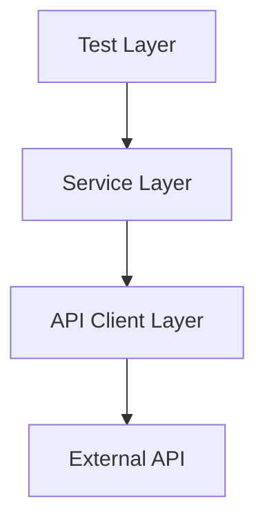

# Architecture Overview

## Framework Architecture
The framework follows a simple layered structure that keeps test logic separate from API interaction details.

## Layer Explanation

### Test Layer
The test layer contains Playwright test cases that define business scenarios such as create, read, update, and delete operations.

### Service Layer
The service layer provides a clean interface for API operations. It keeps endpoints and request payloads organized and reusable.

### API Client Layer
The API client layer handles common HTTP operations such as GET, POST, PUT, and DELETE, along with shared headers, timeouts, and error handling.

### External API
The framework targets JSONPlaceholder as the external API under test.

## Folder Structure
- src/api/ApiClient.ts – reusable HTTP client
- src/api/PostService.ts – service wrapper for post operations
- src/data/testData.ts – test data definitions
- src/Environment.ts – environment-based configuration
- tests/posts.spec.ts – API test suite
- playwright.config.ts – test and reporting configuration

## Component Responsibilities
- ApiClient: centralizes request execution and response handling
- PostService: exposes domain-specific methods for posts
- Test files: validate expected behavior and assertions
- Environment module: provides configuration without hardcoded values

## Design Decisions

### Why Playwright API testing
Playwright provides a modern automation approach with strong support for API requests and a familiar test runner experience for teams already using Playwright.

### Why TypeScript
TypeScript improves code clarity, reduces runtime errors, and provides better maintainability for growing automation suites.

### Why service layer design
A service layer helps isolate test logic from endpoint implementation and makes the framework easier to extend.

### Why environment-based configuration
Environment-based configuration makes the framework portable across development, QA, and CI environments without changing source code.

### Why reusable API client approach
A reusable API client reduces duplication, standardizes request behavior, and improves consistency across tests.
